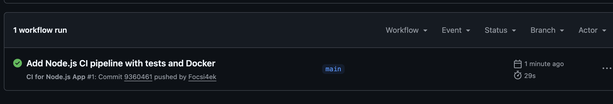
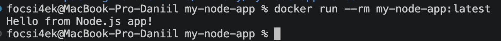

# 🟢 Node.js CI Pipeline with GitHub Actions

**Автор:** Абрамов Даниил Сергеевич

Учебный проект для изучения **Continuous Integration (CI)** на примере простого Node.js-приложения.

Проект автоматически проверяется с помощью **GitHub Actions**: выполняется линтинг через ESLint, тестирование через Jest сразу на нескольких версиях Node.js, а после успешного прохождения проверок собирается Docker-образ приложения.

---

## 🎯 Цель проекта

Основная цель — настроить полноценный CI Pipeline для Node.js-приложения.

В рамках проекта реализованы:

- автоматический запуск CI при push
- запуск CI при Pull Request
- проверка JavaScript-кода через ESLint
- автоматические тесты через Jest
- тестирование на нескольких версиях Node.js
- контейнеризация приложения с Docker
- автоматическая сборка Docker-образа
- локальная проверка контейнера
- работа без локальной установки Node.js

---

## 🛠️ Используемые технологии

| Технология | Назначение |
|---|---|
| 🟢 Node.js | Среда выполнения JavaScript |
| ⚙️ GitHub Actions | Автоматизация CI |
| 🧪 Jest | Автоматическое тестирование |
| 🔍 ESLint | Проверка качества кода |
| 🐳 Docker | Контейнеризация приложения |
| 📦 npm | Управление зависимостями |
| Git | Контроль версий |
| GitHub | Хранение исходного кода |

---

## 📁 Структура проекта

    my-node-app/
    ├── .github/
    │   └── workflows/
    │       └── ci.yml
    │
    ├── src/
    │   └── index.js
    │
    ├── tests/
    │   └── index.test.js
    │
    ├── .eslintrc.json
    ├── Dockerfile
    ├── package.json
    ├── package-lock.json
    ├── README.md
    ├── 01-github-actions-success.png
    └── 02-docker-run-success.png

---

# 🟢 Приложение

Основной код находится в:

    src/index.js

Приложение содержит простую функцию сложения:

    function add(a, b) {
      return a + b;
    }

Также присутствует функция запуска:

    function main() {
      console.log("Hello from Node.js app!");
    }

При запуске приложение выводит:

    Hello from Node.js app!

---

# 🧪 Автоматические тесты

Для проверки приложения используется **Jest**.

Тесты находятся в:

    tests/index.test.js

Проверяются несколько вариантов работы функции `add`:

    add(2, 3) === 5
    add(-1, 1) === 0
    add(0, 0) === 0

Запуск тестов:

    npm test

Ожидаемый результат:

    PASS tests/index.test.js

    Tests: 3 passed, 3 total

---

# 🔍 Проверка кода с ESLint

Для статического анализа используется **ESLint**.

Конфигурация находится в файле:

    .eslintrc.json

ESLint проверяет:

- синтаксические ошибки
- проблемы со структурой JavaScript-кода
- неопределённые переменные
- неиспользуемые переменные
- соблюдение рекомендуемых правил

Запуск:

    npm run lint

---

# ⚙️ GitHub Actions

Workflow расположен по пути:

    .github/workflows/ci.yml

Pipeline автоматически запускается при:

    push

и:

    pull_request

для веток:

    main
    master

---

# 🔄 CI Pipeline

Общая схема:

    Developer
        │
        │ git push
        ▼
    GitHub Repository
        │
        ▼
    GitHub Actions
        │
        ▼
    ┌──────────────────────────┐
    │       Lint & Test        │
    │                          │
    │ Node.js 18.x             │
    │ Node.js 20.x             │
    │ Node.js 22.x             │
    └─────────────┬────────────┘
                  │
                  │ success
                  ▼
    ┌──────────────────────────┐
    │    Build Docker Image    │
    │                          │
    │      my-node-app:test    │
    └─────────────┬────────────┘
                  │
                  ▼
             ✅ Success

---

# 🧩 Matrix Testing

Pipeline использует **Matrix Strategy**.

Приложение автоматически проверяется сразу на нескольких версиях Node.js:

| Версия |
|---|
| Node.js 18.x |
| Node.js 20.x |
| Node.js 22.x |

GitHub Actions создаёт отдельный job для каждой версии.

Это позволяет проверить совместимость приложения с разными версиями Node.js.

---

# 📦 package.json

Файл `package.json` содержит:

- название проекта
- версию приложения
- зависимости
- npm-скрипты
- точку входа

Основные команды:

    npm test
    npm run lint
    npm start

---

# 🔒 package-lock.json

Файл:

    package-lock.json

фиксирует точные версии зависимостей.

Это обеспечивает воспроизводимую установку пакетов как локально, так и в GitHub Actions.

В проекте он был создан через Docker без установки Node.js на macOS:

    docker run --rm -v "$(pwd):/app" -w /app node:18-alpine npm install --package-lock-only

---

# 🐳 Работа через Docker

Одно из условий проекта — не устанавливать Node.js локально.

Поэтому зависимости, тесты и линтинг можно запускать через Docker.

Например:

    docker run --rm \
      -v "$(pwd):/app" \
      -v /app/node_modules \
      -w /app \
      node:18-alpine \
      sh -c "npm ci && npm run lint && npm test"

Таким образом Node.js работает внутри временного контейнера.

---

# 🐳 Dockerfile

Dockerfile использует официальный образ:

    node:18-alpine

Основные этапы:

    Node.js Alpine
          │
          ▼
    Working directory
          │
          ▼
    Copy package files
          │
          ▼
    npm ci
          │
          ▼
    Copy application
          │
          ▼
    Start application

---

## 🔨 Сборка Docker-образа

Локальная сборка:

    docker build -t my-node-app:latest .

Для GitHub Actions используется:

    docker build -t my-node-app:test .

---

## ▶️ Запуск контейнера

Запуск приложения:

    docker run --rm my-node-app:latest

Результат:

    Hello from Node.js app!

После завершения процесса контейнер автоматически удаляется благодаря:

    --rm

---

## 💻 Интерактивный режим

Для работы внутри контейнера:

    docker run --rm -it my-node-app:latest /bin/sh

Выход:

    exit

---

# 🚀 Этапы GitHub Actions

Workflow выполняет следующие шаги.

### 1. Checkout

GitHub Actions загружает репозиторий:

    actions/checkout@v4

### 2. Setup Node.js

Устанавливается требуемая версия Node.js:

    actions/setup-node@v4

### 3. npm ci

Устанавливаются зависимости:

    npm ci

В отличие от обычного `npm install`, команда использует точные версии из `package-lock.json`.

### 4. ESLint

Проверяется исходный код:

    npm run lint

### 5. Jest

Запускаются автоматические тесты:

    npm test

### 6. Docker Build

После успешного прохождения всех проверок выполняется:

    docker build -t my-node-app:test .

---

# 🔗 Зависимость между Jobs

Docker-сборка зависит от успешного завершения тестирования:

    needs: test

Это означает:

    Lint или Test failed ❌
             │
             └── Docker Build не запускается

    Все проверки прошли ✅
             │
             ▼
         Docker Build

Таким образом Docker-образ собирается только после успешного CI.

---

# 🖥️ Результат GitHub Actions

После push Workflow запускается автоматически.

Успешный запуск отображается зелёной галочкой.

GitHub Actions выполняет проверки для Node.js 18.x, 20.x и 22.x, после чего запускает Docker Build.

---

# 🐳 Результат локального запуска Docker

После сборки образа приложение успешно запускается:

    docker run --rm my-node-app:latest

Результат:

    Hello from Node.js app!

---

# ✅ Что проверяет CI

| Этап | Инструмент |
|---|---|
| Получение исходного кода | GitHub Checkout |
| Установка Node.js | setup-node |
| Установка зависимостей | npm ci |
| Проверка кода | ESLint |
| Автоматические тесты | Jest |
| Проверка Node.js 18.x | ✅ |
| Проверка Node.js 20.x | ✅ |
| Проверка Node.js 22.x | ✅ |
| Сборка Docker-образа | Docker |

---

# 📌 Continuous Integration

**Continuous Integration** — это практика автоматической проверки изменений после их отправки в репозиторий.

Вместо ручного запуска всех проверок разработчик выполняет:

    git push

После чего GitHub Actions автоматически:

    Получает код
         ↓
    Устанавливает Node.js
         ↓
    Устанавливает зависимости
         ↓
    Проверяет код через ESLint
         ↓
    Запускает Jest
         ↓
    Собирает Docker-образ
         ↓
    Показывает результат

---

# 🔁 Проверка изменений

Для запуска нового Pipeline достаточно:

    git add .
    git commit -m "Update Node.js application"
    git push

После push GitHub Actions автоматически выполнит все проверки заново.

---

# 📚 Полученные навыки

В рамках проекта были освоены:

- настройка CI для Node.js
- работа с GitHub Actions
- YAML Workflow
- Matrix Strategy
- тестирование на нескольких версиях Node.js
- работа с Jest
- работа с ESLint
- использование npm
- создание package-lock.json
- работа с Node.js через Docker
- создание Dockerfile
- сборка Docker-образа
- запуск Docker-контейнера
- настройка зависимости между jobs
- автоматическая проверка при push и Pull Request

---

# 🎯 Итог

В проекте создан полноценный учебный **CI Pipeline для Node.js-приложения**.

При каждом push GitHub Actions автоматически:

- проверяет код через ESLint
- запускает Jest-тесты
- выполняет тестирование на Node.js 18.x, 20.x и 22.x
- после успешных проверок собирает Docker-образ

Итоговая схема:

    Code → Lint → Test → Docker Build → ✅

Проект демонстрирует базовый принцип Continuous Integration для Node.js-приложений с использованием **GitHub Actions и Docker**.

---

## 👨‍💻 Автор

**Абрамов Даниил Сергеевич**

**Node.js CI Pipeline © 2026**